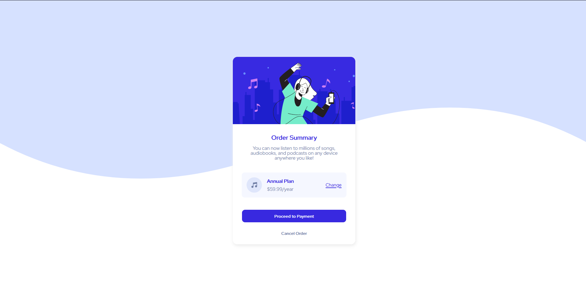

# Frontend Mentor - Order summary card solution

This is a solution to the [Order summary card challenge on Frontend Mentor](https://www.frontendmentor.io/challenges/order-summary-component-QlPmajDUj). Frontend Mentor challenges help you improve your coding skills by building realistic projects.

## Table of contents

- [Overview](#overview)
  - [The challenge](#the-challenge)
  - [Screenshot](#screenshot)
  - [Links](#links)
- [My process](#my-process)
  - [Built with](#built-with)
  - [What I learned](#what-i-learned)
  - [Continued development](#continued-development)
  - [Useful resources](#useful-resources)
- [Author](#author)

## Overview

### The challenge

Users should be able to:

- View the optimal layout for the app depending on their device's screen size
- See hover states for all interactive elements on the page
- Select and submit a number rating
- See the "Thank you" card state after submitting a rating

### Screenshot



### Links

- Live Site URL: [site URL here](https://masterpm.github.io/Order-summary-card/)

## My process

### Built with

- Semantic HTML5 markup
- CSS custom properties
- Flexbox
- CSS Grid

### What I learned

From this project i have learn lot of like beautiful color"gradient" and some css code..... and last is I'm proud of js here the code:

```js
const cardcontainer = document.querySelector(".card-container");
const thanksContainer = document.querySelector(".thank-contianer");
const submitbtn = document.getElementById("submit");
const rateAgain = document.getElementById("rateAgain");
const rating = document.getElementById("rating");
const rates = document.querySelectorAll(".rate-btn");

submitbtn.addEventListener("click", () => {
  thanksContainer.classList.remove("hidden");
  cardcontainer.style.display = "none";
});

rateAgain.addEventListener("click", () => {
  thanksContainer.classList.add("hidden");
  cardcontainer.style.display = "block";
});

rates.forEach((rate) => {
  rate.addEventListener("click", () => {
    rating.innerHTML = rate.innerHTML;
    // console.log(rate.innerHTML)
  });
});
```

, Thank you for reading.

### Continued development

anyway I'm not good at now, the best way to improve i will more practice to do the best and never stop learning. last is i will say that thank you for reading \_\_\_

### Useful resources

- [w3schools](https://www.w3schools.com/) - This helped me for some guide css. I really liked this website and will use it going forward..
- [ChatGPT](https://chat.openai.com) - This helped me for some guide solve error code . I really love it.

## Author

- Frontend Mentor - [@maipenrai23](https://www.frontendmentor.io/profile/maipenrai23)
